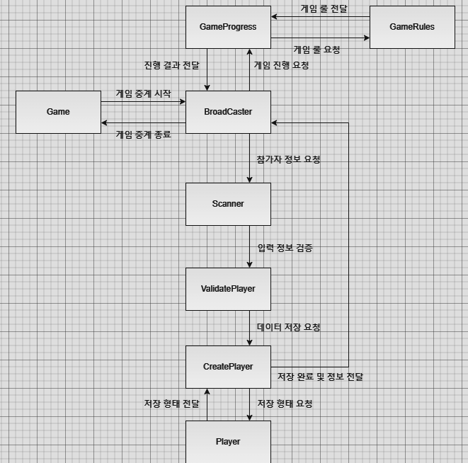

# 희조 멘토님과 공부

- 객체 지향의 이해와 역량 증진을 위한 공부

## 프로젝트 소개

- 어수선한 공부의 틀을 바로 잡고 방향성을 명확히 하고 
- 제대로 된 공부와 취업 포트폴리오를 위한 프로젝트

### 1. 우테코 자동차 경주 게임

#### 객체 관계도

클래스 관점이 아닌 오로지 객체 관점에서만 바라보고 그들의 관계도를 그려보자.

#### 개발환경

1. 언어 : Java 
2. Tool : Github

#### 주요 기능

- 자동차 경주 선수에 이름 부여.
- 자동차 경주 진행 과정 및 결과 발표.
